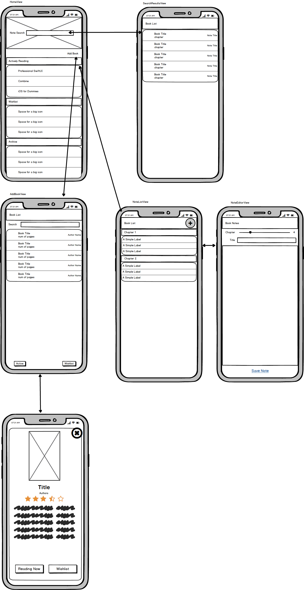

# Book Notes

## Purpose

Book Notes is an iOS app meant to serve as both a Reading Log and a place to take notes on a book by chapter. This application serves as a reference implementation of how I architect and application and organize a code base. This project is not complete, but it does show patterns for talking to APIs ([Google Books API](https://developers.google.com/books), in this case) and storing and retrievig data from a local database.

## Design

The app was conceptualized using wireframes using Balsamiq Mockups. Only some of the features were completed in a weekend hackathon - as indicated. It consists of the following views:

- ✅ **Home View:**
  - The app landing page which shows the books you're actively reading, wishlist items, and archived books.
  - A searchbar at the top allows you to do a keyword search through your notes (not implemented)
  - An 'Add Book' link navigates to the AddBookView so you can find your next book to add to your reading list or to wishlist
- ✅ **Add Book View:**
  - This view provides a basic content search using Google Book API. It provides a results list with a summary of each book.
  - You can tap on an item to see further book detail
  - The detail view allows you to add the book to the Active Reading list or Wishlist
- ✅ **Book Detail View:**
  - Displays a larger view of the book cover (for those who judge books by their cover) and provides more fields
  - You can close out of the description by hitting an 'x' in the top right corner
  - Buttons at the bottom of the display let you add it to your reading list or wishlist
- ❌ **Book Note List**
  - From the Home View, tapping on a book should display a list of notes separated by sections for each chapter. A note consists of a title and a body. The titles would display in this list
- ❌ **Note Editor View**
  - This is the data entry area for note taking
  - Chapter titles would have been up to the user to provide since the API didn't include any contents
  - I had lots of ideas for alternative methods for taking notes including
    - traditional keyboard entry
    - Speech to Text dictation
    - Audio recordings
    - (iPad only) - Handwriting
  - None of the alternative methods were in scope for the weekend hackathon, but it would be a fun exercise to continue
- ❌ **Note Viewer** (not shown)
  - There would probably need to be a read-only view of a note for when you tapped on an existing note or performed a search. - - It's possible the searched note would need a separate reader that shows some book information
- ❌ **Note Search Results**
  - Finally, there would need to be a screen or a series of screens for when you perform a Note Search from the home screen

## Architecture

My architectural preferences are inspired by Clean Architecture patterns that separate each layer of the application from

- View
- ViewModel (MVVM)
- Model
- Services
- Data Repository
- Data Access Layer
  - Data Transfer Objects

The architecture pattern is designed to be loosely coupled with each section only being dependent on the layer to the right. Each layer is separated by protocols defining the API. Multiple implementations could be provided and swapped out. This may be done because of changing vendors, changing approaches, or mocking an implementation for testing purposes. Careful consideration has to go into the interfaces that makes it generic enough to be reuseable, but specific enough to provide the necessary information the implementation needs. This can be especially challenging on the data layer since it often interfaces with 3rd party solutions that follow specific patterns.

### User Interface

SwiftUI has been a paradigm shift for the Apple platform that promotes responsive, declarative designs over a more explicit style that view controllers required. This lends itself well to the Model-View-ViewModel pattern. Now the user interface can be generally laid out and set up with bindings that react to changes in state.

Not only does the UI respond to state, but the ViewModel allows for all the logic to be encapsulated in a natural way in a standalone, easily testable class. If the state is being set correctly, you can be reasonably assured that the app behavior should be in good working order.

### Services Layer

The heavy lifting of logic should be encapsulated into a service. A service tends to be specific to a particular domain. These instances tend to be singletons. By organizing business logic into services, they become reusable and consistent across the app. Imagine if a particularly complex calculation needs to happen in the app, which is displayed in multiple views, it would be very easy to have that calculation implemented slightly differently if each ViewModel is responsible for the logic.

A Service is responsible for using the data layer to fetch the raw data. It will then transform, filter, sort (though sorting is often best done close to the data, if possible) and providing additional business logic and tranformations to the returned data.

If the repository data layer is skipped, the services may also be responsible for translating data transfer objects to model objects.

### Data Layer

The data layer provides potentially two sublayers - the repository and the data access objects. The repository is useful in larger applications or applications that combine a lot of data sources. The repository provides a simpler facade interface to the services. Repositories can be organized in different ways, but I prefer to keep them domain specific. A repository would be responsible for converting DTO's to domain objects.

When dealing only with one or two data sources, I tend to omit the repository because it ends up adding more classes that do little but pass data directly through from the DAO to the services. I tend to start without a repository and refactor into it as things get more complex.

The Data Access Object should be a direct interface with a data provider. It knows how to perform CRUD operations based on what the provider offers. It's best for the DAO to provide inputs that control the projection, filtering, and sorting so the results can be most specifically requested since performance on data retrieval is optimized closest to the data source.

DAO's operate using Data Transfer Objects. These are no-logic (or low logic, perhaps, if there is transforational helper methods) that mirror the data source's object model. Seldom is a data provider's model in the proper shape that optimizes the app. So that is why it's important to have two sets of objects. I tend to group DTO's with the Data Access group since it is likely implementation specific.

### Testing

Automated tests are necessary to ensure the app remains flexible to adaptation. It's the measuring stick as to whether a change can happen without having far reaching implications. Most of the application is very suitable to unit tests. In fact, I tend to do unit tests on all but the edges of the architecture (UI and DAO). These edges can and should still be tested, but they have their special types of tests in the form of UI tests and integration tests.

## Application Considerations

I wanted to try to implement the app as close to real world as I could. The trade off in doing this is less of the app getting implemented. Here are a few notes about the implementation of this particular app.

- The app uses two data sources

  - Google Books API - for searching for books and gathering book details including cover art
  - Local Database - Once a book is saved to the reading list or wishlist, the data is retrieved from a local SQLite database

- I chose against using a repository since there are only two data sources. This cut down on a layer of code that would have little responsibility

- For local data, I chose [GRDB](https://github.com/groue/GRDB.swift) over something like CoreData or something bigger like a Firebase. In a real world application, I may prefer Firebase or Realm so the data syncing is built in. I tend to not want to use CoreData unless the project requires it just because of it's close ties to Objective C and forcing me to use NSObject instead of structs for my data objects. This was my first time using GRDB and it was amazing! It set up really easily and provides direct control of the database. Of course, the use case was rather simple.

- I originally planned on saving cover images locally for performance and offline reasons. Time was running low so I took this out.

- The archived list wasn't implemented. The intention was that you could archive a book once you tapped on it from the reading list. You would not be able to archive a book from the wishlist, you could merely delete it.
